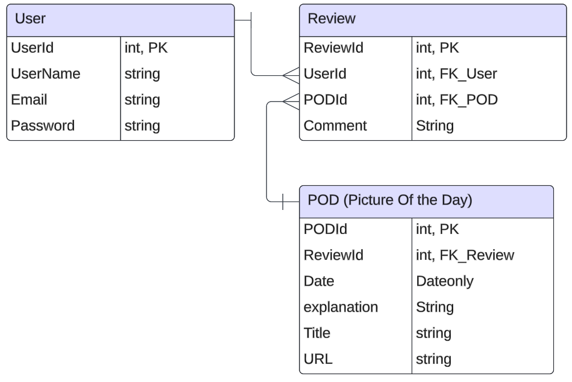

# Group2Backend

# Full stack Astronomy App
ASTRO - An astronomy-based Social media.

## Project Members
    - Praween Pongpat
    - Prabveer Pannu
    - Joseph Savage
    - Justin Theyskens

## Project Requirements
- Application Must build and run
- Unit Testing (70% branch coverage for Services and Utilities/Business Logic)
- Must have front-end build with React and talking to Back end
- Front end should have styling applied, you can use plain css, or Tailwind, or bootstrap, whatever you want. 
- Utilize an external API
- Backend(API) hosted on Azure Cloud Services
- DB hosted on Azure Cloud Services
- Backend Repo
- Frontend Repo

## Tech Stack
- C# (Backend programming language)
- EF Core (ORM)
- SQL Server (Azure hosted)
- ASP.NET Core (Web API Framework)
- xUnit/Moq (Backend Testing)
- Azure App Service (for application hosting)
- React as front end

## User Stories
- User login
- User can browse NASA images.
- User can search NASA images by date
- User can search NASA images by start date and end date.
- Users can leave comments on pictures.

## ER Diagram

## MVP Goals
- Database of Users
- Database of Images
- Database of comments by Users.
- App should be able to retrieve images from the NASA API and store it in its own database.
- App should be able to allow users to Create comments under those images and store them in its database.
- APp should be able to store created Users in its User database.

## Stretch Goals
- User authentication 

